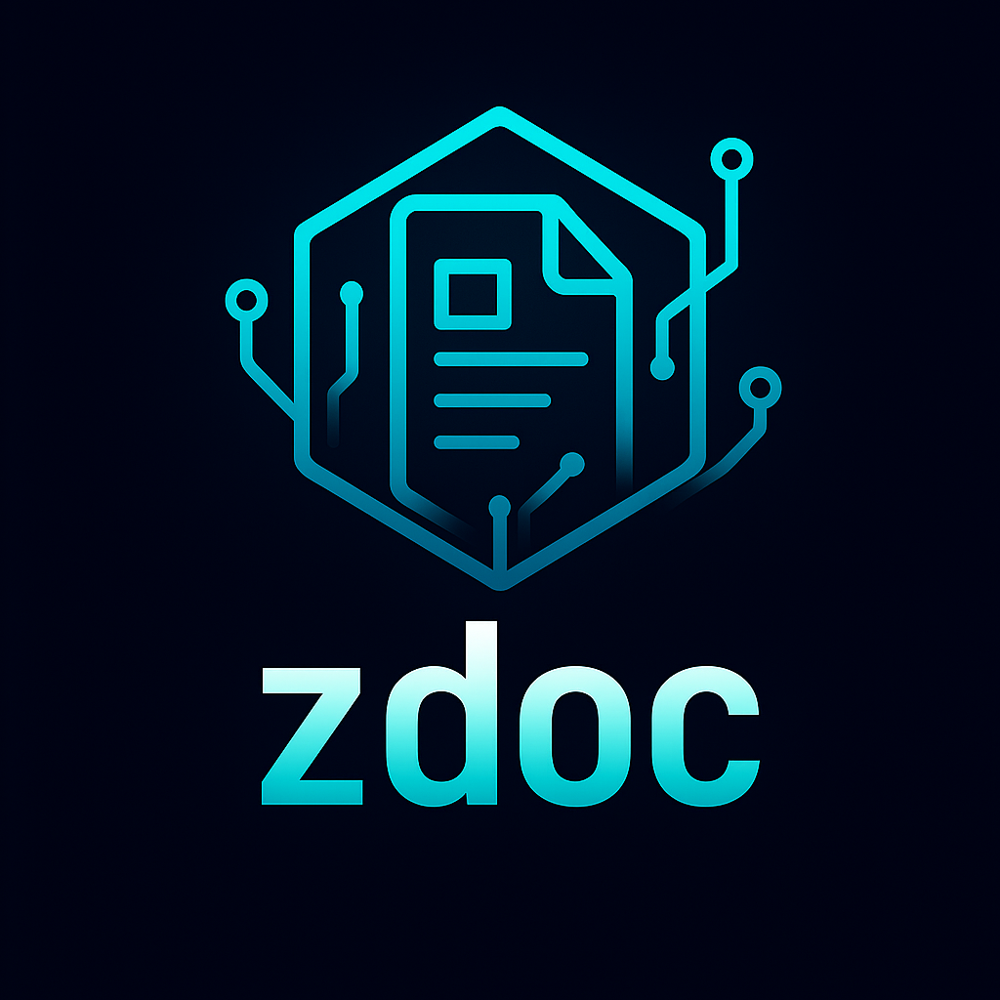

# zdoc

<p align="center">
  
</p>

[](https://ziglang.org/)
[](https://ziglang.org/)
[](https://commonmark.org/)
[](https://ziglang.org/)

A documentation generator for Zig projects, inspired by Doxygen and Sphinx.

## Integration

Add zdoc to your project as a dependency:

```bash
zig fetch --save https://github.com/ghostkellz/zdoc/archive/refs/heads/main.tar.gz
```

## Usage

```bash
zig build run -- <input.zig> <output_dir>
```

This will parse the Zig source file and generate HTML documentation in the specified output directory.

## Features (MVP)

- Parses Zig source files using the AST
- Extracts public function and variable declarations
- Generates basic HTML documentation with a list of declarations

## Future Features

- Markdown integration for rich documentation
- Live code examples with interactive execution
- Multiple output formats (HTML, PDF, etc.)
- API documentation, tutorials, and interactive examples
